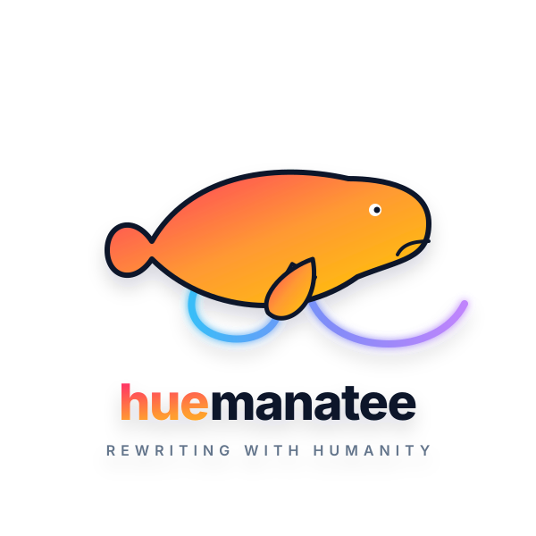

<p align="center">
  
</p>

<p align="center">
  <strong>Make AI prose sound human.</strong><br>
  Cut the plastic sheen. Keep the meaning.<br>
  Leave the facts to the author.
</p>

<p align="center">
  <a href="#install"></a>
  
  <a href="#automatic-activation"></a>
</p>

<p align="center">
  A focused writing skill for turning robotic, over-balanced drafts into
  competent human prose without padding the copy or inventing specifics.
</p>

<p align="center">
  <a href="#install">Install</a> ·
  <a href="#update">Update</a> ·
  <a href="#automatic-activation">Automatic activation</a> ·
  <a href="#how-it-works">How it works</a> ·
  <a href="#scope">Scope</a>
</p>

---

## Install

### Claude Code

```text
/plugin marketplace add GentBajko/huemanatee
/plugin install huemanatee@huemanatee-marketplace
```

This installs the skill and its automatic prompt hook.

### Any other agent

The Skills CLI installs the canonical skill bundle, including its
`references/` file:

```bash
npx skills add GentBajko/huemanatee
```

The same repository can be installed to a specific agent or globally:

```bash
npx skills add GentBajko/huemanatee --agent codex --global
npx skills add GentBajko/huemanatee --agent cursor --global
```

The portable skill is automatic only where the host supports skill
selection. Host-level hooks are separate; see [Automatic activation](#automatic-activation).

## Update

| Installed with | Update with |
| --- | --- |
| Claude Code plugin | `claude plugin marketplace update huemanatee-marketplace`<br>then `claude plugin update huemanatee@huemanatee-marketplace` |
| `npx skills` | `npx skills update` |

Restart the host after a plugin update if it keeps an older skill or hook
in memory.

## Automatic activation

The Claude Code marketplace plugin and the Codex plugin bundle a
`UserPromptSubmit` hook. It watches for requests about rewriting,
humanizing, robotic or ChatGPT-like prose, and similar wording. When a
prompt fits, it adds a small reminder to use Huemanatee and its tell
catalog.

The hook deliberately leaves source code, configuration, and
machine-readable output alone. Explicitly naming Huemanatee still works
when the target is prose.

Codex may ask you to review and trust the bundled hook before it runs. That
is a one-time safety check for plugin-provided commands.

Hooks are host-specific. The `npx skills` command installs skill files; it
does not edit each agent's global hook configuration. Current native hook
surfaces include:

| Host | Prompt hook | Huemanatee status |
| --- | --- | --- |
| Claude Code | `UserPromptSubmit` | Bundled in the marketplace plugin |
| Codex | `UserPromptSubmit` | Bundled in `.codex-plugin` |
| Gemini CLI | `BeforeAgent` | Supported by Gemini, but not installed by `npx skills` |
| Cursor | `beforeSubmitPrompt` | Supported by Cursor; use skill discovery for context injection |

See the host documentation for [Claude hooks](https://code.claude.com/docs/en/hooks),
[Codex hooks](https://developers.openai.com/codex/hooks),
[Gemini CLI hooks](https://github.com/google-gemini/gemini-cli/blob/main/docs/hooks/reference.md),
and [Cursor hooks](https://cursor.com/docs/hooks).

## How it works

Huemanatee follows a strict rewrite contract:

* **Shrink to fit:** Preserve the original meaning and dialect, but cut
  throat-clearing. The result can be shorter; it is never padded to hit a
  word count.
* **No invented facts:** If the draft needs a metric or anecdote only the
  author knows, leave a marked slot instead of making one up.
* **Silent delivery:** Return only the rewritten text unless the user asks
  for commentary or an explanation.
* **Asymmetric coverage:** Skip the obvious and spend words where the
  argument actually needs them.

Before a longer rewrite, the skill reads
[`references/tells.md`](skills/huemanatee/references/tells.md), which covers:

* ban-list vocabulary and stock phrases;
* uniform rhythm, fake parallelism, and the “not just” construction;
* unnecessary headings, summary closers, and brochure-like tone;
* a final pass for substance, specificity, and a sharp ending.

## Scope

Huemanatee is for blog posts, articles, marketing copy, release notes,
READMEs, and other prose. It is not for source code, configuration files,
structured data, or machine-readable output.

If the goal is passing an AI detector, the skill makes prose less
recognizably synthetic to human readers but cannot guarantee a classifier
result. High-stakes authorship still needs details and manual edits from the
actual author.
